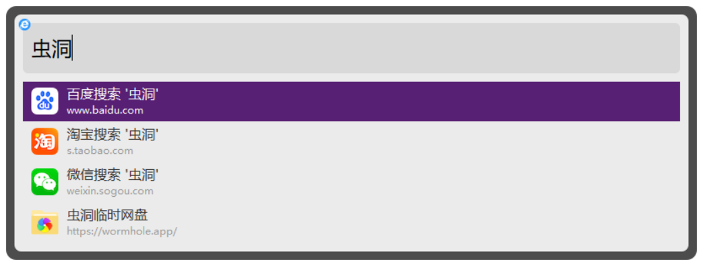

## 无名书签助手  
项目简介：
- 使用 vue3 TypeScript 开发
- 目前仅适配 chrome 内核浏览器

### 当前功能

- 双击键盘上的"S"键可快搜搜索，快速查找书签功能。

### 未来计划功能

1. 书签管理
   - 新增标签功能。
2. 数据云同步
   - 使用 WebDAV 进行数据备份。

### 为何开发书签助手

1. 快速搜索
   我使用了一款全局搜索软件[火萤/火柴](https://www.huochaipro.com/)多年，它能全局搜索文件，并且还支持书签搜索。然而，该软件长时间未更新，书签搜索功能仅限于某几个浏览器。而对于新出的浏览器或绿色版浏览器，无法进行书签搜索。由于我主要使用的浏览器已经更换，因此我首要考虑开发书签助手以实现书签搜索功能。
   

2. 增加标签
   管理大量书签非常困难。根据相互独立、完全穷尽（MECE）原则对书签进行分类几乎是不可能的，因为同一个网站可能符合多种分类。受到微信文章收藏功能的设计启发，我决定引入标签的概念来管理书签。

### 参考

- 基于[vite-vue3-chrome-extension-v3](https://github.com/mubaidr/vite-vue3-chrome-extension-v3)项目开发
- 搜索界面参考[omni](https://github.com/alyssaxuu/omni)项目
